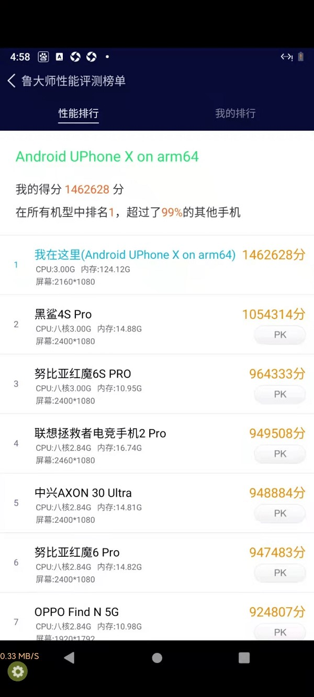

<!-- 以下是参考的目录模版，旨在建议产品文档应该包含的内容模块。实际章节划分可根据实际内容进行调整 -->
# 概览

云手机产品主要提供云手机服务器、云手机、手机应用、手机镜像的生命周期管理功能。同时提供Web页面和API调用两种操作方式，用户可批量申购、释放服务器，批量创建、重启云手机，批量上传、安装或卸载云手机应用，对自制的云手机镜像进行批量克隆，以及对服务器和云手机资源负载进行实时监控

#### 
  [了解](#_1了解)   |   [购买及付费](#_2购买及付费)   |   [快速上手](#_3操作指南)  
  

## 1.了解

云手机产品主要提供云手机服务器、云手机、手机应用、手机镜像的生命周期管理功能。同时提供Web页面和API调用两种操作方式，用户可批量申购、释放服务器，批量创建、重启云手机，批量上传、安装或卸载云手机应用，对自制的云手机镜像进行批量克隆，产品支持安卓、iOS和H5多种访问方式

### 功能与优势
#### 突破算力瓶颈
采用ARM服务器和GPU渲染，突破传统手机和SoC云手机的硬件算力瓶颈，可运行最耗算力的安卓应用，亦可基于此设计长期的原生安卓云游戏、元宇宙演进路线
#### 
#### 高灵活度
区别于SoC云手机架构，客户可任意的对整台服务器切割成各种规格的云手机，如1C1G或20C80G
#### 高性能
UCloud云手机基于原生ARM CPU、自研安卓虚拟化技术、GPU直通安卓技术、内核调优，裸金属主机可高性能运行80-160路应用，小实例主机运行20-40路应用
#### 高灵活度、高利用率
传统SoC（片上系统）架构只能运行2-3个实例，剩余的资源碎片无法使用，而不同帧率和分辨率又无法混跑，进而会产生多种资源池、增大管理复杂度。而ARM服务器架构只需一种规格即可运行所有实例，实例按需使用CPU和GPU资源，多余CPU和GPU算力碎片由内核调度给其他实例使用；而不同分辨率和帧率的实例亦可混跑，实现服务器资源最大利用率，也简化资源管理复杂度。
####  高性能
传统x86 CPU模拟安卓应用的ARM指令会有20-30%开销，还有的采用EmuGL来实现OpenGLES到OpenGL的指令转换，都存在性能损耗大、延迟大、卡顿等体验问题。
UCloud云游戏基于原生ARM CPU、自研安卓虚拟化技术、GPU直通安卓技术、内核调优，高性能运行80-120路游戏。

### 应用场景
#### 游戏辅助
支持一键新机、独立IP；支持物理键盘、复制粘贴、文件上传；支持群控管理；支持海外机房，畅玩国际服
#### 企业办公
数据存放云端更安全；企业无需一次性购置真机，按需租赁轻资产管理；支持多人同屏协同，帮助客户远程一对一指导；可通过RPA自动化脚本处理机械重复工作
#### 私域流量
支持微信、企业微信等应用构建私域流量; 支持一键新机、GPS
#### 跨境电商
支持海外机房TikTok等应用,帮助中国企业出海; 支持海外独立IP
#### 开发测试
可用几千台云手机模拟真实业务并发，对业务后台进行压测

## 2.购买及付费

* [计费模式](/uphone/price#计费模式)
* [ARM服务器配置](/uphone/price#ARM服务器配置)
* [资源删除](/uphone/price#资源删除) 

## 3.操作指南

* [注册控制台账号](/uphone/signin#注册控制台账号)
* [创建云手机服务器](/uphone/signin#创建云手机服务器)

