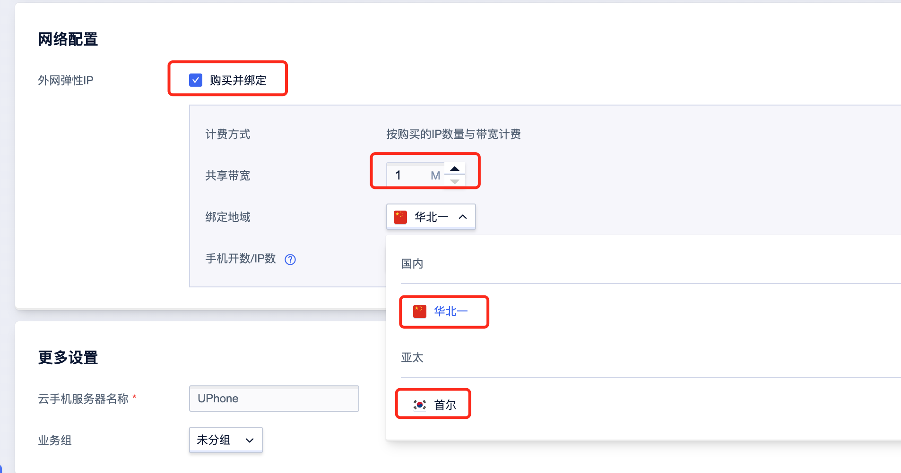

## 操作指南
### 注册账号
 
### 快速测试
  华北一面向国内云手机场景；广州主要面向非大陆的云手机场景，同时也支持国内场景；
  独立IP和共享带宽为可选项，不选的话也可以使用但用的是服务器IP，选中后可以用于云手机防关联和实现云手机模拟异地；
 
### 创建云手机
 
 
### 创建云手机服务器
 
 
### 群控管理
 在"云手机管理"页面点击"群控管理"
 
 
 
### 文件上传
#### 1.创建存储空间	 （点击群控页面US3入口创建）
 
#### 2.进入存储空间文件管理，上传文件
 
 
#### 3.复制US3文件地址到群控上传页面
  
 
#### 4.粘贴地址到群控上传页面
 
### 自制镜像
#### 1.创建镜像
  
 
#### 2.查看镜像

#### 3.使用自制镜像创建云手机服务器
 
### 独立公网IP
 可批量将云手机按照绑定比例购买独立IP（支持国内和海外)，批量云手机共享购买的带宽
 
