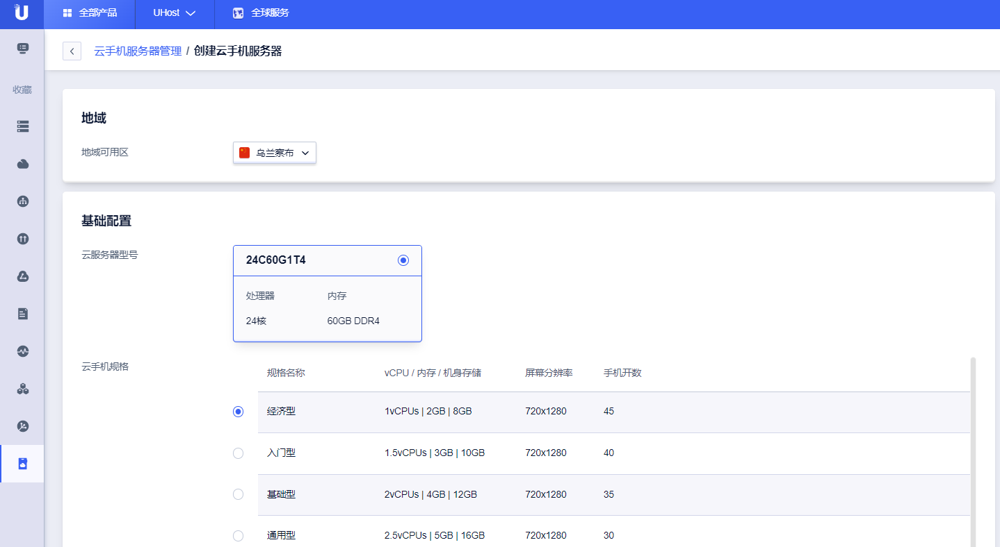

## 计费模式 
* 费用包括：云手机服务器，可选的云手机独立公网IP及共享带宽
* 付费方式：支持按时、按月和按年付费
* 独立公网ip：按实际使用IP个数计费，可选
* 共享带宽：按实际购买的共享带宽计费，与独立公网IP一同使用，可选
* [创建第一台服务器](https://console.ucloud.cn/uphone/server)

## 云手机服务器
|配置       |详情            |
|:-------------|:----------------|
|CPU       | 安培ARM 28大核 3.0GHZ         |
|内存       |60GB                       |
|显卡       |1张NVIDIA Tesla T4          |
|存储       |512G SSD云盘（扩容按存储价格计费）|
|网卡       |25Gbps                      |
|云手机独立IP     |按需购买               |
|安卓虚拟化   |免费支持                   |
|音视频控制流 |免费支持                   |
|客户端二次开发     |免费提供 Web控制台、安卓、iOS SDK   |
|管理平台  |免费支持                  |
|群控画面带宽  |默认免费赠送4Mbps |
|一键新机  | 免费支持 |
|更新GPS  | 免费支持 |
|更新分辨率 DPI  | 免费支持 |
|主账号子账号  | 开发中，敬请期待 |
|云手机摄像头  | 开发中，敬请期待  |
## 产品计费
* 服务器
|地域       |配置      |价格(元/台/月)|
|:--------|:---------:|:-----------:|
|广州  |28C60G |2950|
|广州   |32C80G |3250|
|华北二   |28C60G |2450|
|华北二   |32C80G |2900|
* IP&带宽
|地域|画面带宽|独立ip&独立带宽 |
|:---------------|:---------|:-----------|
|华北二(仅作为国内场景)   | 5M免费,超过部分：15元/M          |国内:北京 上海 广州 独立ip:35元/个/月 独立带宽：120元/Mbps/月|
|广州(跨境场景为主,国内场景为辅)| 5M免费,超过部分：25元/M         |大陆外自建带独立ip:40元/个/月 大陆外专线带宽(元/Mbps/月)： 香港：100 台北：170 新加坡：120 菲律宾：180 越南：420元 泰国：300元 印尼：450 韩国：220 日本：150 洛杉矶：300 法兰克福：710 伦敦820|
## 退费规则
在您删除云手机的相关实例后，您当月未消费的款项会按照退费规则退还到您的帐户中。
